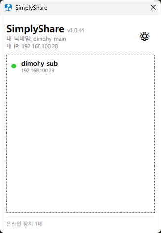
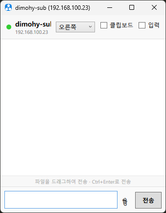
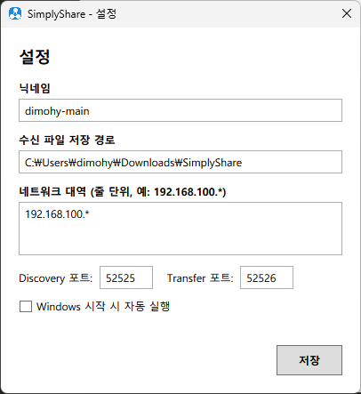

# SimplyShare

> 내부 네트워크용 간편 텍스트 & 파일 공유 앱

별도의 서버 없이 같은 네트워크 안의 PC끼리 텍스트와 파일을 **드래그 앤 드롭**으로 간편하게 주고받을 수 있습니다.





## 주요 기능

- **장치 자동 발견**: UDP 브로드캐스트로 네트워크 내 SimplyShare 사용자 자동 검색
- **파일/폴더 전송**: 드래그 앤 드롭으로 GB급 대용량 파일도 전송 (진행률 표시)
- **텍스트 공유**: 클립보드 자동 감지 + 버튼 클릭으로 즉시 전송
- **지속 채팅 연결**: 장치 간 1:1 채팅 세션 유지 + 메시지/파일 통합 흐름
- **원격 입력 공유**: 1:1 연결에서 마우스/키보드 입력 공유 (경계 방향 설정 지원)
- **암호화 통신**: ECDH 키 교환 + AES-256-GCM 암호화
- **스마트 업데이트**: 더 높은 버전 장치 감지 시 업데이트 EXE 자동 다운로드/적용 후 재시작
- **시스템 트레이 상주**: 최소화 시 트레이에서 백그라운드 동작
- **Windows 알림**: 수신 시 Toast 알림
- **수신 수락/거부**: 파일 수신 전 확인 팝업

## 기술 스택

| 항목       | 기술                                 |
| ---------- | ------------------------------------ |
| 프레임워크 | .NET 10                              |
| 언어       | C# 14                                |
| UI         | WPF (MVVM)                           |
| 통신       | TCP + UDP (P2P, 서버 없음)           |
| 암호화     | ECDH P-256 + AES-256-GCM             |
| 배포       | ReadyToRun + Self-Contained 단일 EXE |

## 화면/동작 포인트

- **메인 창**: 온라인 장치 목록, 상태 메시지, 설정 진입 버튼
- **대화 창**: 텍스트 메시지/파일 전송, 클립보드 공유, 원격 입력(마우스/키보드) 제어
- **시스템 트레이**: 최소화 시 백그라운드 상주, 복원/종료 메뉴
- **알림 흐름**: 수신 요청 안내 후 수락/거부 선택
- **업데이트 흐름**: 새 버전 감지 → 자동 다운로드 → 교체 후 앱 재시작

## 빌드 및 실행

### 요구 사항

- .NET 10 SDK

### 디버그 실행

```powershell
dotnet run --project src/SimplyShare
```

### 릴리스 빌드 (단일 EXE)

```powershell
dotnet publish src/SimplyShare/SimplyShare.csproj -c Release -r win-x64
```

빌드 결과: `src/SimplyShare/bin/Release/net10.0-windows/win-x64/publish/SimplyShare.exe`

## 사용법

### 빠른 시작



1. **앱 실행 & 닉네임 설정**

   - 처음 실행 시 닉네임을 입력합니다.
   - 필요하면 네트워크 대역(`192.168.100.*` 형식)을 설정합니다.
2. **전송할 대상 선택**

   - 같은 네트워크의 SimplyShare 장치가 자동으로 목록에 표시됩니다.
   - 보낼 대상 장치를 클릭해 선택합니다.
3. **전송 방식 선택**

   - **파일/폴더 전송**: 파일(또는 폴더)을 창으로 드래그 앤 드롭
   - **텍스트 전송**: 텍스트를 복사한 뒤 클립보드 패널에서 전송 버튼 클릭
4. **수신 확인**

   - 상대 장치에서 Toast 알림과 수신 확인 팝업이 표시됩니다.
   - 수락 시 파일은 기본 다운로드 폴더에 저장됩니다.

### 원격 마우스/키보드 공유 (1:1)

1. 장치와 채팅 연결이 수립되면 대화 창 상단의 **입력** 옵션을 켭니다.
2. 필요 시 경계 방향(오른쪽/왼쪽/상단/하단)을 맞춰 원격 전환 방향을 설정합니다.
3. 활성화 중에는 상대와 입력 상태가 동기화되며, 종료 시 옵션을 끄면 즉시 해제됩니다.

### 스마트 업데이트

- 같은 네트워크에서 **더 높은 버전** 장치가 발견되면 업데이트 다운로드가 자동 시작됩니다.
- 다운로드 완료 후 앱이 새 실행 파일로 교체되고 자동 재시작됩니다.
- 재시작 이후 실패 상태가 있을 경우 팝업/로그로 원인을 확인할 수 있습니다.

### 전송 팁

- 대용량 파일은 네트워크 상태에 따라 시간이 걸릴 수 있으며, 진행률 표시로 상태를 확인할 수 있습니다.
- 양쪽 PC가 같은 네트워크 대역에 있고 방화벽 정책이 허용되어야 장치 발견/전송이 정상 동작합니다.
- 앱을 닫아도 트레이에 남아 동작할 수 있으므로, 완전 종료가 필요하면 트레이 메뉴에서 종료하세요.

## 네트워크 설정

- 기본 Discovery 포트: `52525` (UDP)
- 기본 Transfer 포트: `52526` (TCP)
- 네트워크 대역 필터: 설정에서 `192.168.100.*` 형식으로 지정 가능

## 문제 해결

- **장치가 보이지 않을 때**
  - 두 PC가 같은 네트워크 대역인지 확인합니다.
  - 방화벽에서 앱 통신 허용 여부를 확인합니다.
- **전송이 지연될 때**
  - 무선망 품질과 파일 크기를 확인합니다.
  - 동시에 많은 대용량 전송을 피하면 안정적입니다.
- **앱이 안 보일 때**
  - 트레이 아이콘을 더블클릭해 창을 복원합니다.

## 앞으로의 계획

- [MewUI](https://github.com/aprillz/MewUI) 적용으로 NativeAOT 지원
- 원격 키보드 및 마우스 동작성 개선 (드라이브 방식?)
- 화면 공유

## 라이선스

MIT

---

GitHub Copilot + GPT-5.3-Codex로 작성/정리되었습니다.
